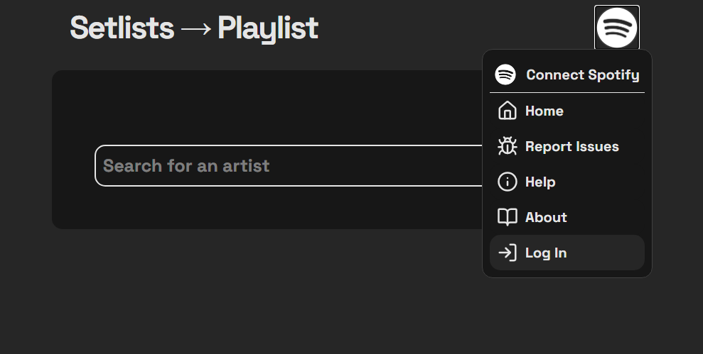
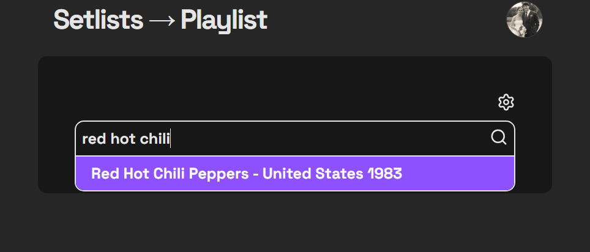
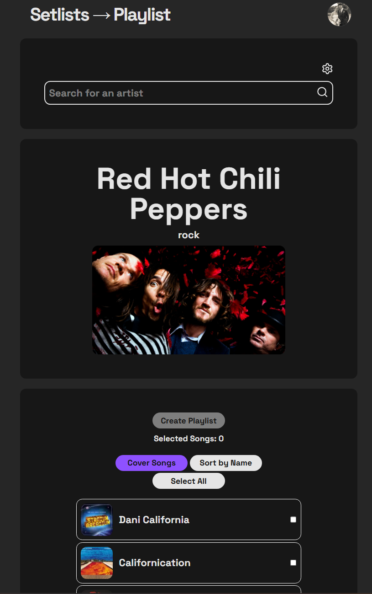
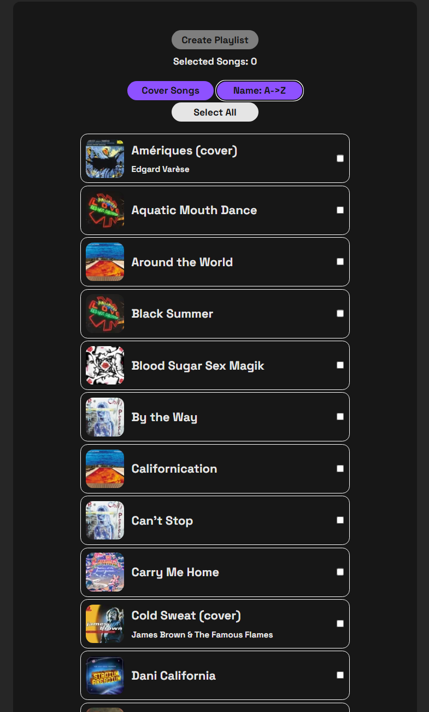
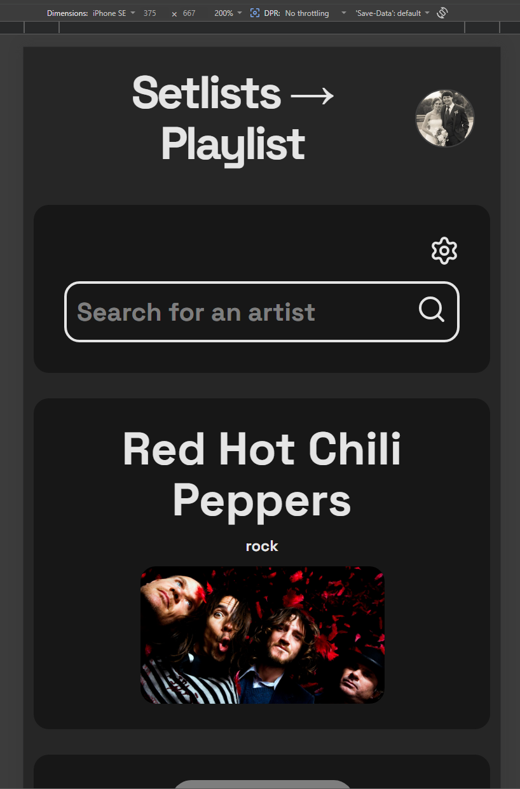
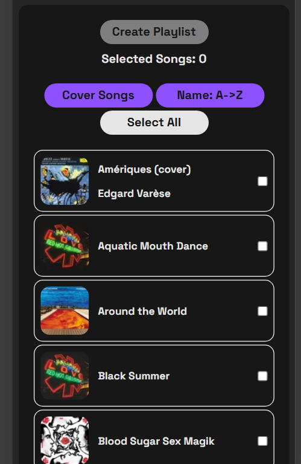

# Setlist -> Playlist via Spotify App

This web application built using React w/ TypeScript allows users to interactively search for a musical artist, view their most recently played songs from live shows, and then turn them into a custom Spotify playlist. This is a great tool for getting exposure to a new band, or preparing to see a band live and getting more familiar with their music!

Updates to come:
* Search filtering - as of now there is no real filtering, any artist can come up including classical composers such as Beethoven.
* A playlist CAN be generated from selecting Beethoven, and it's interesting to see the results from these kind of older artists, but user's should be able to filter to only modern artists.
* Ability for user to customize playlist name - currently hard set at "[Artist Name] - Recent Songs"
* Playlist creation status - currently minimal confirmation of the playlist being successfully created. Create a status icon to indicate a song was successfully imported into the newly created playlist.

## Log in with your Spotify account

## Search for your artist of choice

## Artist search results 

## Sort by name, and filter to include or exclude cover songs

## Mobile friendly design
 

## Tech Stack
* React, TypeScript, Tailwind CSS. 
* Integrates the MusicBrainz, Setlist.fm, Last.fm, Fanart.TV, and Spotify APIs.
* Spotify auth via OAuth 2.0 with PKCE.
